# Anamnesis E-commerce Platform

Plataforma de e-commerce fullstack para venda de documentos digitais, com fluxo de anamnese pré-compra para validação de dados do cliente, checkout integrado e painel administrativo completo.

## 📸 Imagens do projeto

<!-- Troque os nomes abaixo pelos arquivos reais da pasta assets/ -->

**Página inicial / vitrine de produtos**

  <!-- Todas as imagens agora têm width="250" e height="167" -->
  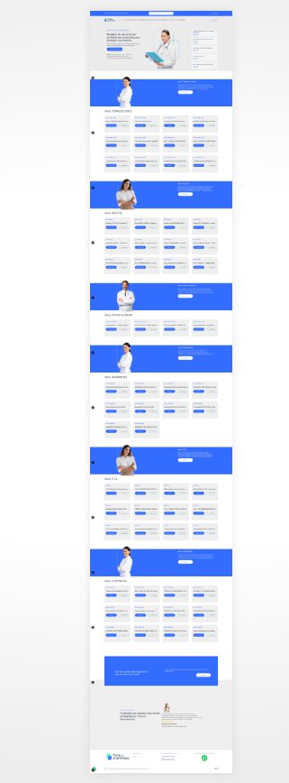
  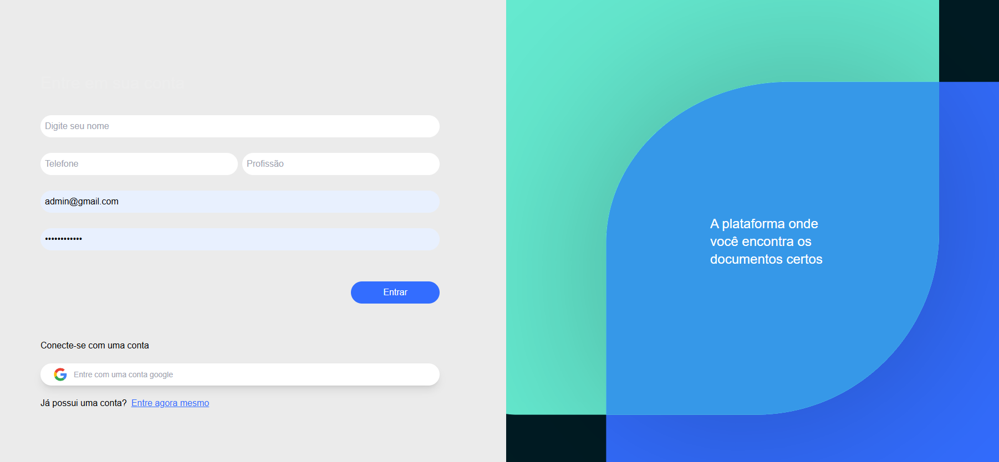
  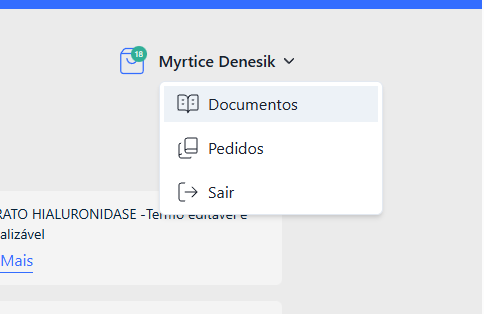
  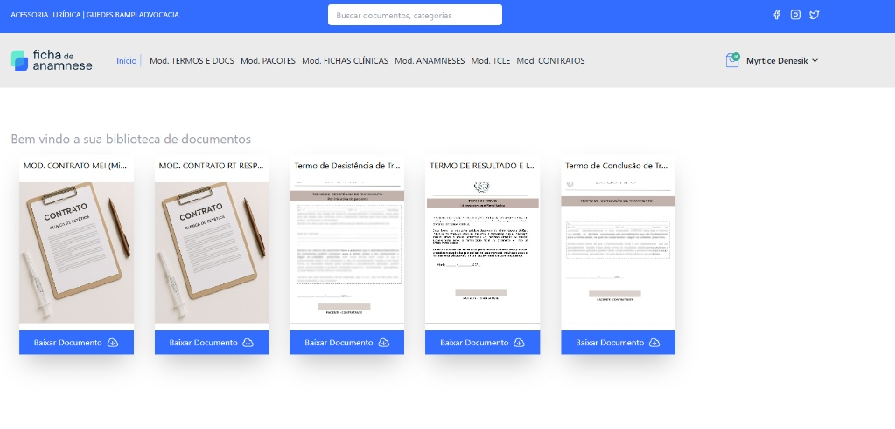
  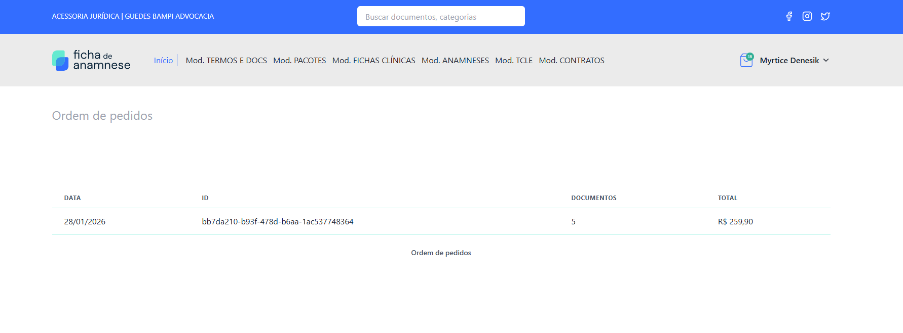
  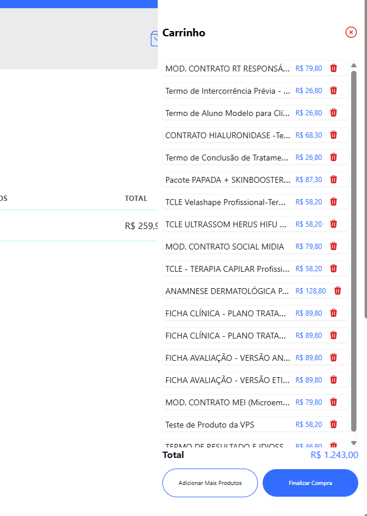

**Fluxo de anamnese (validação pré-compra)**

**Checkout — Pagar.me (Pix e cartão)**

**Painel administrativo — gestão de produtos**

  <!-- Todas as imagens agora têm width="250" e height="167" -->
  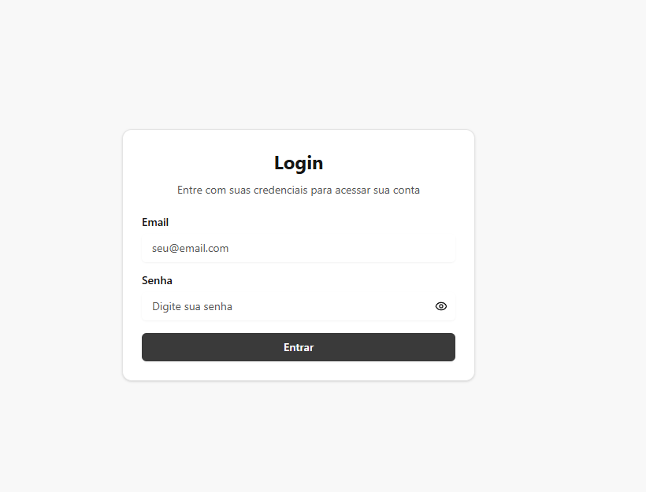
  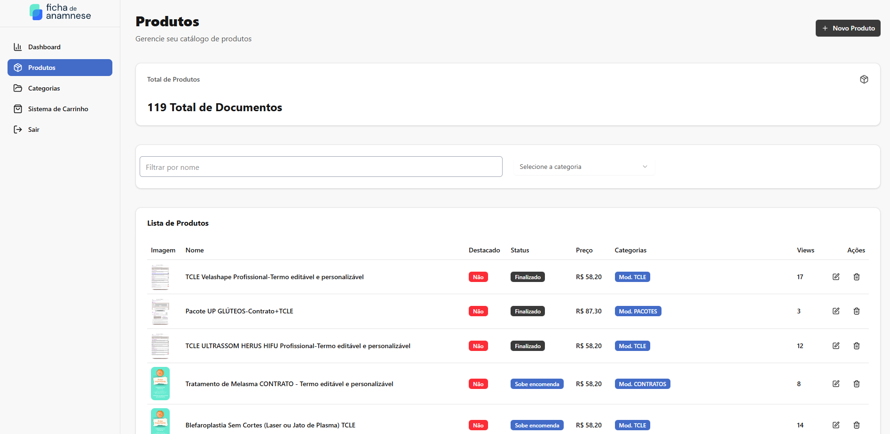
  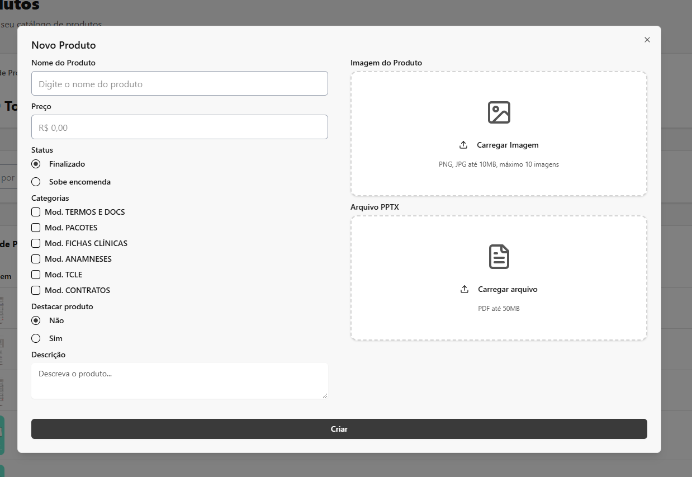
  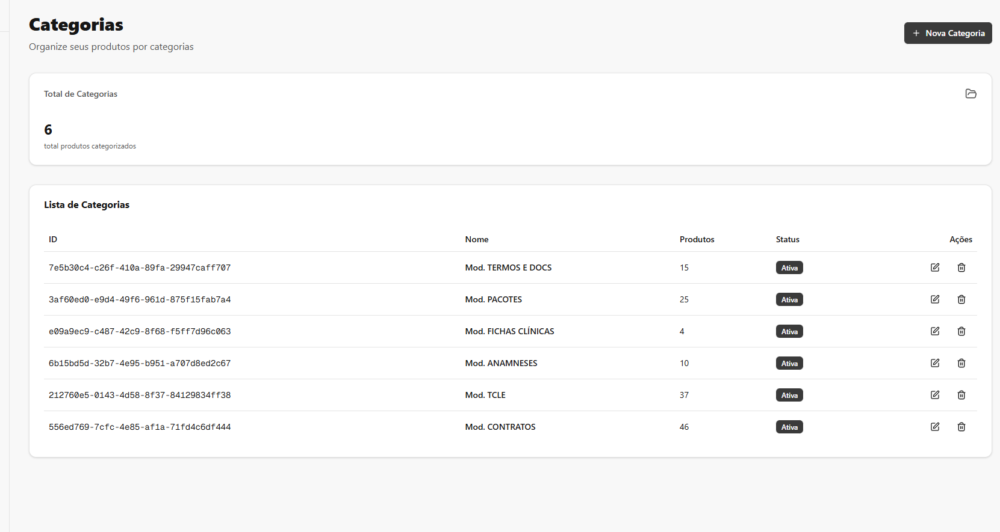
  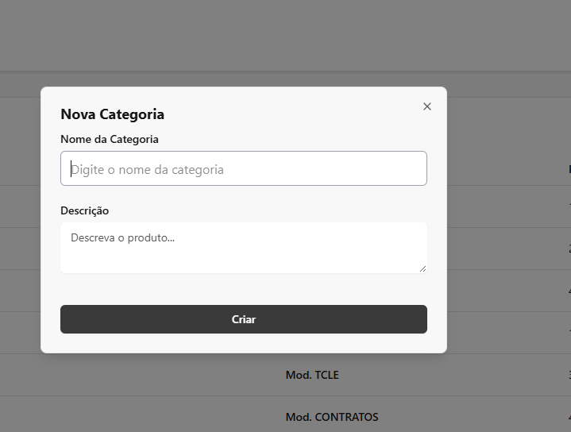
  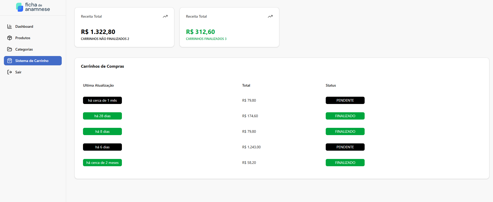

## 🧩 Sobre o projeto

Sistema desenvolvido para automatizar a venda de documentos digitais, com foco em segurança de dados, validação de informações do cliente antes da compra (anamnese) e automação de processos financeiros. Projeto em produção, desenvolvido de ponta a ponta (API, painel admin e infraestrutura).

## ⚙️ Funcionalidades

- Catálogo de produtos digitais com cadastro via painel admin
- Fluxo de anamnese para validação de dados antes da finalização da compra
- Checkout com Pagar.me — Pix e cartão de crédito
- Upload e armazenamento seguro de documentos e imagens via AWS
- Painel administrativo em Next.js para gestão de produtos e pedidos
- API REST em Nest.js com Prisma ORM e PostgreSQL

## 🛠️ Tecnologias

| Camada | Tecnologias |
|---|---|
| Backend | Nest.js, Prisma ORM, PostgreSQL |
| Frontend / Admin | Next.js, React |
| Pagamentos | Pagar.me (Pix, Cartão de Crédito) |
| Armazenamento | AWS |
| Infraestrutura | Docker, VPS Linux, Nginx, Fail2ban |

## 🚀 Deploy

Aplicação em produção, com deploy em VPS própria (Docker + Nginx) e proteção contra acessos indevidos via Fail2ban.

---

Desenvolvido por [Tiago Ramon Becker](https://github.com/TiagoRBecker) — [Portfólio](https://tiagobecker.vercel.app/)
