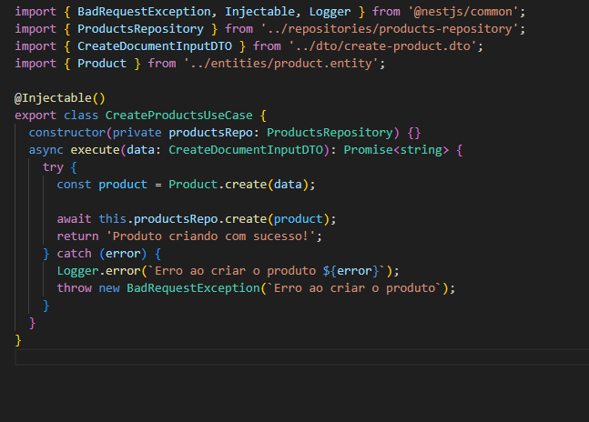
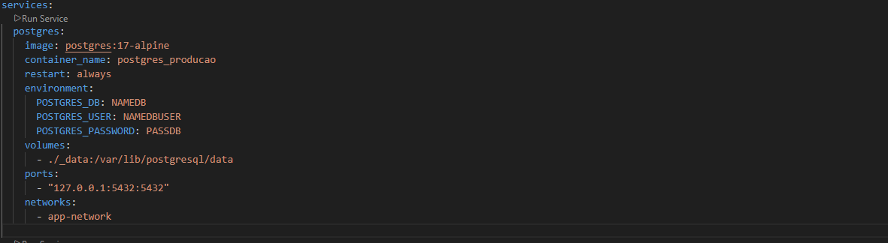

 # 🩺 Ficha de Anamnese - Fullstack E-commerce & SaaS

Este repositório apresenta o **Case Técnico** de uma plataforma robusta de e-commerce voltada para profissionais da saúde. O sistema permite a venda, gestão e entrega automatizada de documentos digitais (fichas de anamnese, TCLE, contratos, etc).

**🔗 Link em Produção:** [www.fichadeanamnese.com.br](https://www.fichadeanamnese.com.br/)

---

## 🏗️ Arquitetura do Sistema

O ecossistema foi desenvolvido com foco em alta disponibilidade e segurança, dividido em:

1.  **Storefront (Next.js):** Experiência do cliente final com foco em performance e SEO.
2.  **API Gateway (NestJS):** Core business logic, processamento de pagamentos e segurança.
3.  **Admin Dashboard (Next.js):** Painel de controle para gestão de produtos, categorias e ordens de serviço.

---

## 🚀 Funcionalidades Técnicas em Destaque

### 🛒 Jornada do Usuário e Checkout
* **Autenticação Segura:** Implementação híbrida com **Google OAuth2** e credenciais via JWT.
* **Gateway de Pagamento:** Integração com **Pagar.me** para processamento de cartões e boletos.
* **Segurança na Entrega:** Sistema de **Hash Única** gerada após aprovação do pagamento, garantindo que o download do documento digital seja seguro e rastreável.

### 🛡️ Engenharia e Infraestrutura
* **Clean Architecture:** Uso de **Use Cases** e **Repository Pattern** no NestJS para um código testável e de fácil manutenção.
* **Blindagem de Servidor:** Dockerização completa com **Nginx** (Proxy Reverso) e **Fail2Ban** (Mitigação de ataques de força bruta).
* **Validação Rigorosa:** Contratos de API protegidos por DTOs com `class-validator`.

---

## 📸 Evidências Técnicas (Showcase)

### 🖥️ Interface do Cliente (Storefront)

  
  

### ⚙️ Painel Administrativo (Backoffice)

  
  

### 💻 Engenharia de Software (NestJS Backend)
Demonstração da organização de pastas e implementação de lógica de negócio isolada (Use Cases):

  

### 🐋 Infraestrutura e Deploy (Docker)
Configuração de ambiente isolado garantindo paridade entre desenvolvimento e produção:

  

---

## 🛠️ Stack Tecnológica

| Camada | Tecnologias |
| :--- | :--- |
| **Frontend / Admin** | Next.js, TypeScript, Tailwind CSS |
| **Backend (API)** | NestJS, PostgreSQL, Prisma/TypeORM |
| **Infraestrutura** | Docker, Nginx, Fail2Ban, Linux VPS |
| **Integrações** | Pagar.me API, Google Auth (OAuth2) |

---

> **Nota Legal:** Por motivos de conformidade e sigilo contratual, o código-fonte integral deste projeto é privado. Este repositório serve como portfólio técnico para demonstrar competências em arquitetura, segurança e desenvolvimento fullstack.

---
## 👤 Autor
**Tiago R. Becker** Desenvolvedor Fullstack focado em soluções escaláveis e seguras.