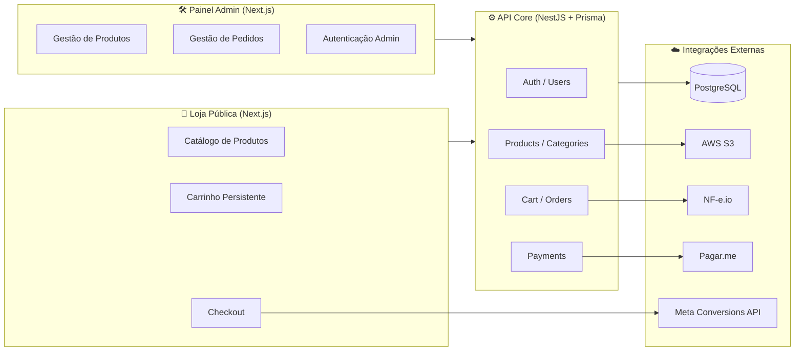

<div align="center">

# Ficha Anmnese Platform

**Plataforma Fullstack de Alta Performance para Gestão e Venda de Documentos Digitais**


**[🔗 Acessar em Produção](https://www.fichadeanamnese.com.br/)**

</div>

---

## 📑 Índice

- [Sobre o Projeto](#-sobre-o-projeto)
- [Nota sobre o Código-Fonte](#-nota-sobre-o-código-fonte)
- [Arquitetura Geral](#️-arquitetura-geral)
- [Destaques Técnicos — Front-end (Loja)](#-destaques-técnicos--front-end-loja)
- [Destaques Técnicos — Painel Admin](#️-painel-administrativo)
- [Destaques Técnicos — API](#-destaques-técnicos--api)
- [Stack Tecnológico](#️-stack-tecnológico)
- [Arquitetura de Produção](#-arquitetura-de-produção)

---

## 🧩 Sobre o Projeto

O **Ficha Anmnese** é uma solução fullstack desenvolvida para automatizar a comercialização de documentos digitais na área de saúde e estética (contratos, TCLEs e fichas de anamnese). O sistema introduz um fluxo crítico de **anamnese pré-compra**, garantindo que as informações do cliente sejam validadas e processadas com segurança antes da efetivação do pagamento.

O projeto está estruturado em três aplicações independentes — loja pública, painel administrativo e API — integradas a serviços externos de pagamento, emissão fiscal, armazenamento e rastreamento de conversão, operando hoje em produção com clientes reais.

---

## 🔒 Nota sobre o Código-Fonte

Este é um projeto privado desenvolvido para cliente. O código-fonte completo não pode ser divulgado por questões contratuais. A documentação abaixo apresenta trechos representativos, decisões de arquitetura e padrões técnicos aplicados no desenvolvimento — o layout visual foi fornecido pelo cliente; a implementação, arquitetura e integrações são de responsabilidade deste desenvolvedor.

---

## 🏗️ Arquitetura Geral



**Fluxo de negócio:** catálogo público → carrinho persistente → checkout → integração com gateway de pagamento → emissão de nota fiscal → liberação do documento na biblioteca do usuário autenticado.

**Reuso de padrões:** os mesmos hooks de data-fetching (`useCategories`, `useDocuments`) e o mesmo padrão de interceptor Axios com refresh de sessão aparecem tanto na loja quanto no painel admin — reflexo de uma abordagem de padrões reutilizáveis entre projetos, em vez de soluções isoladas por aplicação.

---

## 🖥️ Destaques Técnicos — Front-end (Loja)

**Stack:** Next.js (App Router), NextAuth (Google OAuth), TanStack Query, Zustand, Tailwind

### 1. Interceptor Axios sincronizado com sessão NextAuth

Sincroniza o token de acesso com a sessão ativa em cada requisição e força logout automático quando o refresh token expira, evitando chamadas autenticadas com sessão inválida.

```ts
export const api = axios.create({ baseURL: process.env.NEXT_PUBLIC_API_URL });

api.interceptors.request.use(async (config) => {
  const session = await getSession();
  if (session?.user?.accessToken) {
    config.headers.Authorization = `Bearer ${session.user.accessToken}`;
  }
  return config;
});

api.interceptors.response.use(
  (response) => response,
  async (error) => {
    const session = await getSession();
    if (session?.user?.error === "RefreshAccessTokenError") {
      await Swal.fire("Sessão expirada", "Faça login novamente para continuar.", "error");
      await signOut({ callbackUrl: "/", redirect: true });
      return new Promise(() => {}); // trava a request até logout
    }
    return Promise.reject(error);
  }
);
```

### 2. Estado global do carrinho com Zustand + persistência

Carrinho persistido localmente, com feedback visual de sucesso/erro e prevenção de itens duplicados.

```ts
export const useCartStore = create<CartStore>()(
  persist(
    (set, get) => ({
      cart: [],
      addToCart: (item) => {
        const already = get().cart.some((i) => i.id === item.id);
        if (already) {
          toast.warn("Este já foi adicionado ao carrinho!", toastConfig);
          return;
        }
        set((state) => ({ cart: [...state.cart, item] }));
        toast.success("Documento adicionado ao carrinho!", toastConfig);
      },
      removeItemCart: (id) => {
        const exists = get().cart.some((i) => i.id === id);
        if (!exists) return null;
        set((state) => ({ cart: state.cart.filter((i) => i.id !== id) }));
        toast.success("Documento removido do carrinho!", toastConfig);
      },
      clearAllCart: () => set({ cart: [] }),
    }),
    { name: "cart-storage" }
  )
);
```

### 3. Download de arquivo via Blob a partir da API

Conversão da resposta binária da API em Blob para disparo de download no navegador, sem expor a URL real do arquivo.

```ts
const downloadDocLibraryUser = () => {
  return useMutation({
    mutationFn: async (id: string) => {
      const response = await api.post(`/library/user/download/doc/${id}`);
      const url = window.URL.createObjectURL(new Blob([response.data]));
      const link = document.createElement("a");
      link.href = url;
      link.setAttribute("download", "doc.zip");
      document.body.appendChild(link);
      link.click();

      window.URL.revokeObjectURL(url);
      document.body.removeChild(link);
      return response.data;
    },
  });
};
```

### 4. Middleware de proteção de rotas específicas

Proteção seletiva de rotas sensíveis (biblioteca, pedidos, confirmação), mantendo o catálogo e o checkout acessíveis publicamente.

```ts
export { default } from "next-auth/middleware";

export const config = {
  matcher: ["/library/:path*", "/orders/:path*", "/sucess"],
};
```

---

## 🛠️ Painel Administrativo

**Stack:** Next.js (App Router), NextAuth, TanStack Query, React Hook Form + Zod

### 1. Autenticação com refresh de JWT

Renovação automática e transparente do token de acesso a partir do refresh token, sem exigir novo login enquanto a sessão for válida.

```ts
async function refreshAccessToken(token: any) {
  try {
    const response = await axios.post(
      `${process.env.API_URL}/auth/refreshToken/admin`,
      { refreshToken: token.refreshToken }
    );
    const newTokens = response.data;
    return {
      ...token,
      accessToken: newTokens.accessToken,
      refreshToken: newTokens.refresh,
      accessTokenExpires: newTokens.exp,
    };
  } catch (error) {
    return { token, error: "RefreshAccessTokenError" };
  }
}

// dentro dos callbacks do NextAuth:
async jwt({ token, user, account }: any) {
  if (user) {
    token.id = user.id;
    token.accessToken = user.accessToken;
    token.refreshToken = user.refresh;
    token.accessTokenExpires = user.exp;
  }
  if (Date.now() < token.accessTokenExpires * 1000) {
    return token;
  }
  return await refreshAccessToken(token);
}
```

### 2. Interceptor Axios com sessão + logout automático

Trata falhas de rede e expiração de sessão de forma centralizada, evitando repetição dessa lógica em cada chamada do painel.

```ts
axiosConfig.interceptors.request.use(async (config) => {
  const isPublicRoute = publicRoutes.some((route) => config.url?.startsWith(route));
  const session = await getSession();
  if (!isPublicRoute && session?.user?.accessToken) {
    config.headers.authorization = `Bearer ${session.user.accessToken}`;
  }
  return config;
});

axiosConfig.interceptors.response.use(
  (response) => response,
  async (error) => {
    if (error.code === "ERR_NETWORK") {
      await signOut({ redirect: false });
    }
    const session = await getSession();
    if (session?.user?.error === "RefreshAccessTokenError") {
      await Swal.fire("Sua sessão expirou...", "Clique para continuar", "error");
      await signOut({ redirect: false, callbackUrl: "/" });
      return new Promise(() => {});
    }
    return Promise.reject(error);
  }
);
```

### 3. Proteção de rotas via middleware

```ts
export async function middleware(req: NextRequest) {
  const token = await getToken({ req, secret });
  const { pathname } = req.nextUrl;

  if (pathname.startsWith("/dashboard") && !token) {
    return NextResponse.redirect(new URL("/", req.url));
  }
  if (token && pathname === "/") {
    return NextResponse.redirect(new URL("/dashboard", req.url));
  }
  return NextResponse.next();
}
```

### 4. Hook de dados com React Query (cache + mutações + feedback)

Centraliza query, criação e invalidação de cache dos documentos, com feedback consistente de sucesso/erro em toda a aplicação.

```ts
export const useDocumentsHook = () => {
  const { show } = useSwal();
  const queryClient = useQueryClient();

  const docQuery = useQuery({
    queryKey: ["docs"],
    queryFn: async () => (await axiosConfig.get("/products")).data,
  });

  const create = useMutation({
    mutationFn: async (data: DocType) => (await axiosConfig.post("/products/create", data)).data,
    async onSuccess() {
      await queryClient.invalidateQueries({ queryKey: ["docs"] });
      await show("Sucesso", "Documento criado com sucesso", "success");
    },
    async onError() {
      await show("Erro ao criar", "Ocorreu um erro ao criar o documento", "error");
    },
  });

  return { docQuery, create, updateDoc: /* ... */, deleteDoc: /* ... */ };
};
```

### 5. Formulário complexo com upload de arquivos e validação

Fluxo único de criação/edição de produto com upload de documentos e imagens, validado via Zod antes do envio.

```ts
export const useProducthookForm = ({ product, handleCloseModal }: Props) => {
  const form = useForm<DocType>({ resolver: zodResolver(docSchema), defaultValues: { /* ... */ } });

  const handleCreateDocs = async (data: DocType) => {
    try {
      loading("Cadastrando Produtos");
      const docs = await uploadDocs(data.docs);
      const images = await uploadImages(data.images as File[]);
      create.mutateAsync({
        ...data,
        docs: docs ?? null,
        images: images ?? [],
        thumb: images.length > 0 ? images[0] : undefined,
      });
      close();
      handleCloseModal();
    } catch (error) {
      close();
    } finally {
      close();
    }
  };

  const onSubmit = form.handleSubmit((data) =>
    product?.id ? handleUpdateDocs(data) : handleCreateDocs(data)
  );

  return { onSubmit, form, isLoading: create.isPending /* ... */ };
};
```

---

## 🔍 Destaques Técnicos — API

**Stack:** NestJS, Prisma ORM, PostgreSQL, Clean Architecture

### 1. Strategy Pattern para processamento de pagamento

Desacopla diferentes fluxos de checkout (e-commerce, landing page), permitindo adicionar novos tipos de venda sem alterar a lógica central do pagamento — aplicação direta do princípio Open/Closed (SOLID).

```ts
// strategy.interface.ts
export interface IPaymentStrategy {
  execute(dto: ProcessPaymentDTO): Promise<void>;
}

// ecommerce.strategy.service.ts
@Injectable()
export class EcommerceStrategy implements IPaymentStrategy {
  constructor(
    private readonly insertDocLibClient: CreateLibraryUsecase,
    private readonly createOrder: CreateOrderUseCase,
    private readonly markedStatusCart: MarkedSatusCartUseCase,
    private readonly nfeio: EmitNfeioUseCase,
  ) {}

  async execute(dto: ProcessPaymentDTO): Promise<void> {
    await this.insertDocLibClient.execute(dto);
    await this.createOrder.execute(dto);
    await this.markedStatusCart.execute(dto.data.customer.code);
    await this.nfeio.generateNefio(dto);
  }
}

// payment.strategy.resolver.ts
@Injectable()
export class PaymentStrategyResolver {
  private readonly strategies: Record<string, IPaymentStrategy>;

  constructor(
    private readonly ecommerce: EcommerceStrategy,
    private readonly land: LandStrategy,
  ) {
    this.strategies = { ecommerce: this.ecommerce, land: this.land };
  }

  resolve(type: string): IPaymentStrategy | null {
    return this.strategies[type] ?? null;
  }
}
```

### 2. Guard de webhook com autenticação Basic + auditoria

Valida credenciais do provedor de pagamento antes de processar o webhook, registrando tentativas de acesso não autorizado com IP de origem.

```ts
async canActivate(context: ExecutionContext): Promise<boolean> {
  const request = context.switchToHttp().getRequest<Request>();
  const token = this.extractTokenFromHeader(request);

  if (!token) {
    Logger.error('Token invalido');
    throw new UnauthorizedException('Token de segurança invalido');
  }

  const credentials = Buffer.from(token, 'base64').toString('utf8');
  const [user, pass] = credentials.split(':');

  if (user !== this.jwtConfiguration.key_name || pass !== this.jwtConfiguration.key_secret) {
    Logger.error(`Tentativa de push webhook senha ou name invalidos. IP:${request.ip}`);
    throw new UnauthorizedException('Não autorizado a acessar rota de pagamento');
  }
  return true;
}
```

### 3. Upload seguro para S3 com nomes únicos

Gera nomes de arquivo únicos e sanitizados antes do upload, evitando colisões e injeção de caracteres inválidos.

```ts
async uploadFile(file: Express.Multer.File, key?: string) {
  try {
    const name = this.generateName(file);
    const parallelUploads3 = new Upload({
      client: this.s3Client,
      params: {
        Bucket: '*******',
        Key: `private/${name}`,
        Body: file.buffer,
        ContentType: file.mimetype,
      },
    });
    const result = await parallelUploads3.done();
    return result.Key;
  } catch (error) {
    Logger.error(`Erro ao processar a file: ${error.message}`);
    throw new BadRequestException('Erro ao fazer upload privado. Tente novamente mais tarde!');
  }
}

private generateName(file: Express.Multer.File) {
  const originalName = file.originalname.split('.')[0];
  const cleanName = originalName.replace(/\s/g, '').trim();
  const extension = path.extname(file.originalname);
  const timestamp = Date.now().toString();
  return `${cleanName}-${timestamp}-${uuid4()}${extension}`;
}
```

### 4. Login social com Google OAuth + criação automática de conta

Verifica o token do Google, previne conflito com contas já cadastradas via senha e cria a conta automaticamente no primeiro acesso.

```ts
async execute(token: string): Promise<any> {
  const payload = await this.oAuthClient.verifyIdToken({ idToken: token });
  const { email, sub: googleId, name, family_name } = payload.getPayload();

  const user = await this.userRepo.findByEmail(email);
  if (user && user.password) {
    throw new ConflictException(
      'Erro ao criar a conta. O mesmo já possui um login vinculado com credenciais.'
    );
  }

  const existingGoogleUser = await this.userRepo.findByGoogleId(googleId);
  if (!existingGoogleUser) {
    const newUser = User.createUser({ email, name: `${name} ${family_name}`, googleId, /* ... */ });
    const createNewUser = await this.userRepo.create(newUser);
    const { accessToken, exp, refreshToken } = await this.tokenService.generateTokens({
      email: createNewUser.email, id: createNewUser.id, role: 'USER',
    });
    return { name: newUser.name, accessToken, exp, refreshToken };
  }
  // ...retorna tokens para usuário existente
}
```

### 5. Testes unitários com mocks e injeção de dependência

Cobertura de use cases críticos com mocks de repositório e serviços, validando tanto o caminho feliz quanto falhas de infraestrutura.

```ts
describe('SignupAdminUseCase', () => {
  let useCase: CreateAdminUseCase;
  let adminRepoMock: Partial<AdminRepository>;
  let hashMock: Partial<HashingProvider>;

  beforeEach(async () => {
    adminRepoMock = { create: jest.fn().mockResolvedValue(undefined) };
    hashMock = { hashPassword: jest.fn().mockResolvedValue('hashedPassword') };

    const module: TestingModule = await Test.createTestingModule({
      providers: [
        CreateAdminUseCase,
        { provide: AdminRepository, useValue: adminRepoMock },
        { provide: HashingProvider, useValue: hashMock },
      ],
    }).compile();

    useCase = module.get<CreateAdminUseCase>(CreateAdminUseCase);
  });

  it('should hash password, create admin and return success message', async () => {
    const result = await useCase.execute(dto);
    expect(hashMock.hashPassword).toHaveBeenCalledWith(dto.password);
    expect(adminRepoMock.create).toHaveBeenCalledWith(expect.objectContaining({ /* ... */ }));
    expect(result).toBe('Criado com sucesso');
  });

  it('should throw BadRequestException on repository error', async () => {
    adminRepoMock.create = jest.fn().mockRejectedValue(new Error('DB error'));
    await expect(useCase.execute(dto)).rejects.toBeInstanceOf(BadRequestException);
  });
});
```

### 📦 Panorama da Arquitetura — Backend

- **Módulos de domínio:** auth, admin, users, products, categories, cart, orders, payments, library, terms, upload, mailers
- **Integrações externas:** AWS S3 (upload), Pagar.me (pagamento), NF-e.io (nota fiscal), Meta Conversions API (tracking), Google OAuth
- **Padrões aplicados:** Clean Architecture (controller/usecase/repository/entity por módulo), Strategy Pattern (pagamento), Guard/Decorator (autenticação por papel e por webhook), Repository Pattern
- **Qualidade:** testes unitários com Jest e mocks de injeção de dependência, migrations versionadas do Prisma (mais de 40 migrations incrementais, evidenciando evolução real de schema em produção)

---

## 🛠️ Stack Tecnológico

| Camada | Tecnologias |
| :--- | :--- |
| **Backend** | Nest.js, Prisma ORM, PostgreSQL |
| **Frontend / Admin** | Next.js, React, TanStack Query, Zustand |
| **Autenticação** | NextAuth, Google OAuth, JWT com refresh token |
| **Pagamentos** | Integração Pagar.me (Pix & Cartão) |
| **Fiscal** | NF-e.io (emissão automática de nota fiscal) |
| **Armazenamento** | AWS S3 (bucket privado) |
| **Infraestrutura** | Docker, VPS Linux, Nginx, Fail2ban |

---

## 🚀 Arquitetura de Produção

O sistema encontra-se em ambiente de produção, operando sob uma arquitetura conteinerizada. O deploy é gerenciado via **Docker**, garantindo consistência no ambiente de execução, com comunicação entre serviços (API, banco de dados) isolada via **Docker Networks** internas. O **Nginx** atua como *reverse proxy* de entrada, roteando o tráfego externo para os containers corretos, enquanto o **Fail2ban** reforça a camada de segurança monitorando e bloqueando tentativas de acesso indevido.

---

<div align="center">

### Desenvolvido por Tiago Ramon Becker
[🔗 Acessar Portfólio](https://tiagobecker.vercel.app)

</div>
